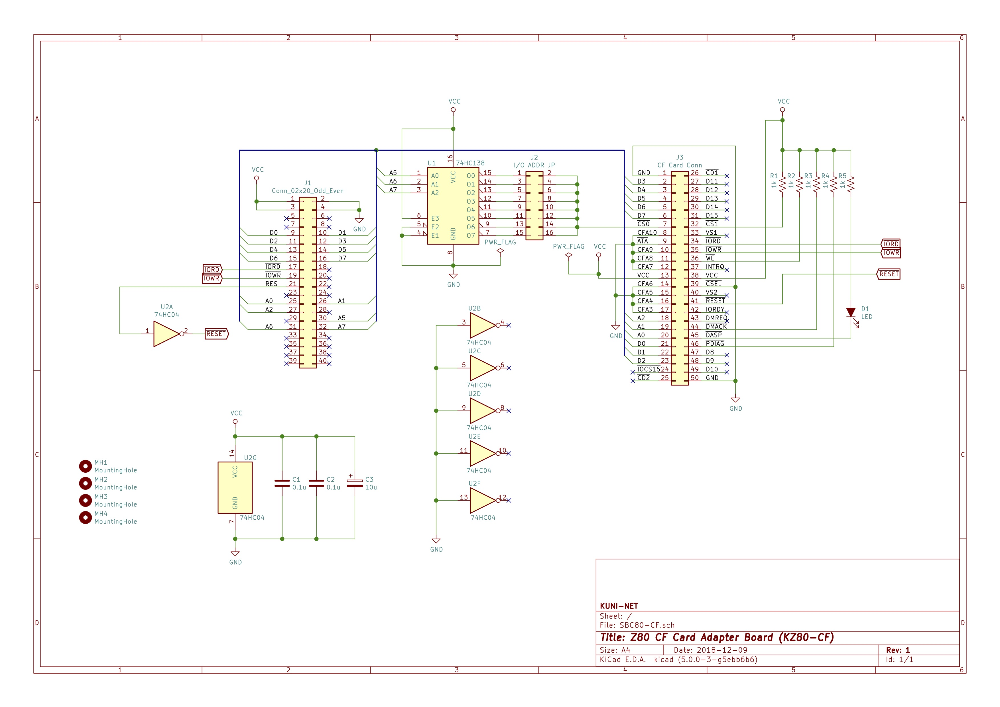

# Z80マイコン コンパクトフラッシュアダプタボード (KZ80-CF)

- SBC8080バスにつながるコンパクトフラッシュボード のデータ類です。
  - [128kB SRAMボード(KZ80-1MSRAM)](https://github.com/kuninet/Z80_1MRAMB)と組み合わせてCP/Mを動かす際に使用できます。

## 回路図

[PDF版回路図はこちら](img/SBC80-CF.pdf)

## 部品表

- 部品表は以下にあります。OpenOffice等のcalcで開ける形式です
  - https://github.com/kuninet/Z80_CF/blob/master/KiCAD/SBC80-CF.ods

## 注意点

- REV1基板はコネクタのピンが誤って逆になっているため、CFカードの表裏を逆に挿入する必要があります。(ガイドのレールを削らないとうまくささりません) REV2では改善しています。
- CFカードコネクタは、REV1では秋月電子で手に入るネジ幅40mmのタイプを使用していますが、REV2ではマルツパーツ、aitendoで手に入るネジ幅38.78mmのタイプへ変更しています。

## ライセンス

- 本リポジトリのデータは MIT License のもとで公開します。

